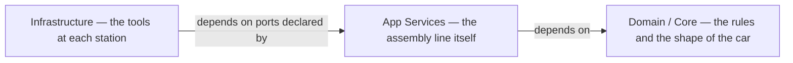
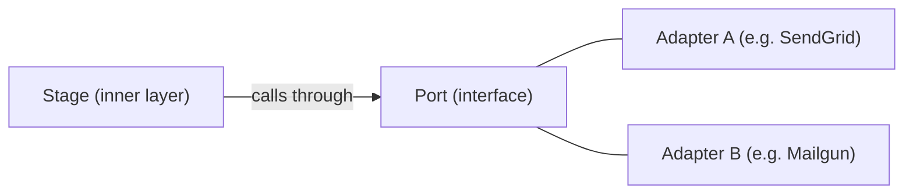
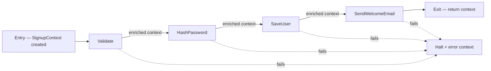
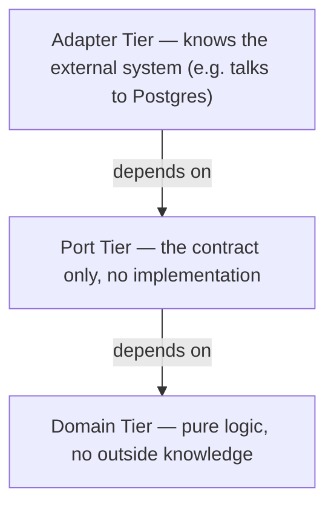

# Pipeline Design Reference

Complete Steps 1–3 before writing code. Breaking any rule means the design is wrong.

---

## Rules

| # | Rule | Broken when… |
| --- | --- | --- |
| 1 | Data flows forward only. | A stage sends data back to an earlier stage. |
| 2 | Each concern has one owner. | Two tools can change the same thing. |
| 3 | Every rule is automatically enforced. | Code review is the only check. |
| 4 | Code only depends on things closer to the core. | A business logic file imports a database driver. |
| 5 | Every component is replaceable. | Swapping it out breaks something it shouldn't touch. |

---

## How It Works

> 🏭 **Think of it like an assembly line.** A car chassis enters at one end. Each station does one job — welds, paints, installs — and passes it forward. No station talks to another. No station sends the car backward. At the end, a finished car comes out.

Your pipeline works the same way. A **context object** enters at the entry point and gets enriched by each stage until it exits.



> 🔌 **Ports and adapters — the station interface.** Each station on the line has a standard mounting point (the **port**). You can bolt on any compatible tool (the **adapter**) — a pneumatic wrench or an electric one — without redesigning the line. Your pipeline stages work the same way: swap the adapter, keep the port, the pipeline doesn't change.



**The context object** is the car chassis — it starts bare and gets enriched at each stage. It is declared by the Domain layer, immutable between stages, and append-only: stages add fields, never remove or rename them.

---

## Step 1 — Who Owns What?

| Concern | Layer | Owner |
| --- | --- | --- |
| **Domain Model** — context shape, preconditions, validation rules. Its own named module always. | Core | |
| **Pipeline Declaration** — the ordered stage list. Owns sequencing; no stage knows about any other. | App Services | |
| **Stage Adapters** — one concrete implementation per external system. | Infrastructure | |
| **State & Secrets** — credentials and env values fed into the context at creation. Encrypted always. | Infrastructure | |
| **Config** — flags, timeouts, feature switches. | Infrastructure | |

Shared owner → note it. Blank owner → fix it.

**Example — user signup pipeline:**

| Concern | Owner |
| --- | --- |
| Domain Model | `src/domain` — `SignupContext` type + validation rules |
| Pipeline Declaration | `src/pipeline.ts` — wires stages in order |
| Stage Adapters | `ValidateAdapter`, `HashPasswordAdapter`, `SaveUserAdapter`, `SendWelcomeEmailAdapter` |
| State & Secrets | Environment variables via `SecretReader` port |
| Config | `config.toml` — token expiry, email sender address |

---

## Step 2 — Declare the Pipeline

> **Decide this first — error strategy.** Pick one: `halt` / `skip` / `retry(n)`. It affects every stage's precondition and idempotency design. Don't fill in stage contracts until it's chosen.

Each stage has a port contract. Preconditions check the **shape of incoming data only** — never whether a previous stage ran. If you're checking that, it's sequencing logic; move it to the pipeline declaration.

```text
Entry point:    who creates the context object and how
Error strategy: halt | skip | retry(n)

Stages (in order):
  1. [Stage name]
     Port:           [PortName]
     Adapter:        [AdapterName]
     Reads:          fields this stage uses from the context
     Writes:         fields this stage adds to the context
     Preconditions:  data shape assertions on the incoming context

Exit point:     what the pipeline returns or emits on completion
```

**Example — user signup:**

```text
Entry point:    HTTP handler creates SignupContext from request body
Error strategy: halt

Stages:
  1. Validate
     Port:           ValidatorPort
     Adapter:        ZodValidateAdapter
     Reads:          email, password
     Writes:         validated: true
     Preconditions:  email and password are non-empty strings

  2. HashPassword
     Port:           HasherPort
     Adapter:        BcryptAdapter
     Reads:          password
     Writes:         passwordHash
     Preconditions:  validated === true

  3. SaveUser
     Port:           UserRepositoryPort
     Adapter:        PostgresUserAdapter
     Reads:          email, passwordHash
     Writes:         userId
     Preconditions:  passwordHash is non-empty string

  4. SendWelcomeEmail
     Port:           EmailPort
     Adapter:        SendGridAdapter
     Reads:          email, userId
     Writes:         emailSent: true
     Preconditions:  userId is present

Exit point:     return enriched SignupContext to HTTP handler
```

### Data Flow



### Contract Matrix

| | Pipeline Declaration |
| --- | --- |
| **Domain Model** | Port: `ContextFactory`, `PreconditionValidator` |
| **Stage 1 … N** | Port: `[StageName]Port` — one per stage |
| **State & Secrets** | Port: `SecretReader` |
| **Config** | Port: `ConfigReader` |

The contract matrix and stage contracts become the Forbidden Dependencies and Port Compliance sections of `ARCHITECTURE.md` and `CONTRIBUTING.md` when those documents are drafted.

---

## Step 3 — Design Components

> 🧱 One brick, one shape. Need "and" to describe it? Split it.

Three tiers per concern — each a separate file, linter-enforced:



**Example — SaveUser concern:**

- **Domain tier:** `User` type, `validateUserId` rule
- **Port tier:** `UserRepositoryPort` — declares `save(context) → context`
- **Adapter tier:** `PostgresUserAdapter` — implements `UserRepositoryPort`, knows SQL

**Component card:**

```text
Name:            Tier: domain / port / adapter
Responsibility:  one sentence
Port:            interface this component satisfies
Reads:           fields consumed from the context
Writes:          fields added to the context
Preconditions:   data shape assertions
Side effects:    none / explicitly named
Idempotent:      yes / no
Cookie-cutter:   yes / no — if no, justify
```

**Rules:** one job · declared interface · no hidden deps · forward-only flow · idempotent if stateful · fail loudly · no cross-tier imports · cookie-cutter first.

**Audit:** all dependencies point inward or stay lateral. Any outward edge → redraw before writing code.
