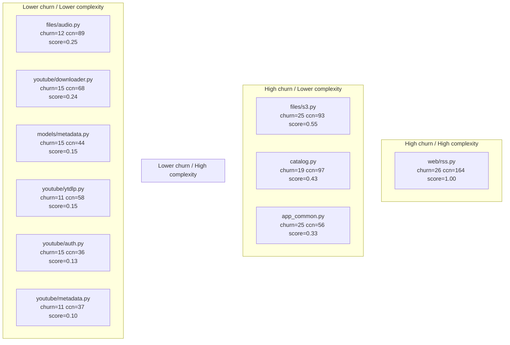

# Architecture Refactoring Playbook

This playbook defines how to reorganize code safely when complexity grows.

## Module Dependency Map

Edges represent real `from src.X import …` relationships in the source tree.
Nodes are grouped into four layers ordered by dependency depth.
Arrows point from dependent to dependency (read: "needs").
This diagram is generated by `runbook/analysis/build_diagram.py` — do not edit by hand.

```mermaid
graph TD
    subgraph sg_entry_points["Entry Points"]
        catalog["catalog.py"]
    end
    subgraph sg_app_layer["App Layer"]
        app_common["app_common.py"]
        app_runner["app_runner.py"]
    end
    subgraph sg_features["Features"]
        subgraph sg_web["web/"]
            web_rss["rss.py"]
            web_sponsorblock["sponsorblock.py"]
        end
        subgraph sg_youtube["youtube/"]
            youtube_auth["auth.py"]
            youtube_downloader["downloader.py"]
            youtube_metadata["metadata.py"]
            youtube_ytdlp["ytdlp.py"]
        end
    end
    subgraph sg_infrastructure["Infrastructure"]
        subgraph sg_files["files/"]
            files_audio["audio.py"]
            files_images["images.py"]
            files_s3["s3.py"]
        end
        subgraph sg_models["models/"]
            models["models.py"]
            models_metadata["metadata.py"]
            models_output["output.py"]
            models_podcast_config["podcast_config.py"]
            models_ytdlp["ytdlp.py"]
        end
        subgraph sg_utils["utils/"]
            utils_cache["cache.py"]
            utils_crypto["crypto.py"]
            utils_image_dedupe_index["image_dedupe_index.py"]
            utils_image_phash["image_phash.py"]
            utils_progress["progress.py"]
            utils_regex["regex.py"]
            utils_text["text.py"]
        end
    end
    subgraph sg_uncategorised["Uncategorised"]
        adapters_docker_secrets["docker_secrets.py"]
        adapters_env_secrets["env_secrets.py"]
        adapters_episode_source_rss["episode_source_rss.py"]
        adapters_episode_source_youtube["episode_source_youtube.py"]
        orchestration_download_service["download_service.py"]
        orchestration_models["models.py"]
        ports_episode_source["episode_source.py"]
        ports_secrets["secrets.py"]
    end

    adapters_docker_secrets --> ports_secrets
    adapters_env_secrets --> ports_secrets
    adapters_episode_source_rss --> app_common
    adapters_episode_source_rss --> catalog
    adapters_episode_source_rss --> models_metadata
    adapters_episode_source_rss --> ports_episode_source
    adapters_episode_source_rss --> web_rss
    adapters_episode_source_youtube --> app_common
    adapters_episode_source_youtube --> catalog
    adapters_episode_source_youtube --> models_metadata
    adapters_episode_source_youtube --> ports_episode_source
    adapters_episode_source_youtube --> youtube_metadata
    files_audio --> utils_progress
    files_s3 --> adapters_docker_secrets
    files_s3 --> adapters_env_secrets
    files_s3 --> models
    files_s3 --> ports_secrets
    files_s3 --> utils_progress
    models_metadata --> models_ytdlp
    orchestration_download_service --> app_common
    orchestration_download_service --> app_runner
    orchestration_download_service --> catalog
    orchestration_download_service --> files_audio
    orchestration_download_service --> files_s3
    orchestration_download_service --> models
    orchestration_download_service --> orchestration_models
    orchestration_download_service --> utils_progress
    orchestration_download_service --> utils_regex
    orchestration_download_service --> web_rss
    orchestration_download_service --> web_sponsorblock
    orchestration_download_service --> youtube_downloader
    orchestration_download_service --> youtube_metadata
    ports_episode_source --> app_common
    ports_episode_source --> models_metadata
    utils_cache --> files_s3
    utils_image_dedupe_index --> utils_cache
    utils_image_dedupe_index --> utils_image_phash
    utils_text --> utils_regex
    web_rss --> app_common
    web_rss --> files_audio
    web_rss --> files_images
    web_rss --> files_s3
    web_rss --> models
    web_rss --> utils_crypto
    web_rss --> utils_image_dedupe_index
    web_rss --> utils_image_phash
    web_rss --> utils_progress
    web_rss --> utils_regex
    web_rss --> utils_text
    web_rss --> youtube_metadata
    web_sponsorblock --> files_audio
    web_sponsorblock --> utils_cache
    web_sponsorblock --> utils_crypto
    web_sponsorblock --> utils_progress
    youtube_auth --> models
    youtube_downloader --> utils_progress
    youtube_downloader --> utils_regex
    youtube_downloader --> youtube_auth
    youtube_metadata --> models
    youtube_metadata --> utils_progress
    youtube_metadata --> utils_regex
    youtube_metadata --> web_rss
    youtube_metadata --> youtube_ytdlp
    youtube_ytdlp --> models
    youtube_ytdlp --> models_ytdlp
    youtube_ytdlp --> utils_cache
    youtube_ytdlp --> utils_progress
    youtube_ytdlp --> youtube_auth
```

### What this tells us

Nodes sorted by number of direct dependents (in-degree >= 2):

| Module | Dependents |
| --- | --- |
| `utils/progress.py` | 8 |
| `models.py` | 6 |
| `app_common.py` | 5 |
| `utils/regex.py` | 5 |
| `ports/secrets.py` | 3 |
| `catalog.py` | 3 |
| `web/rss.py` | 3 |
| `models/metadata.py` | 3 |
| `youtube/metadata.py` | 3 |
| `files/audio.py` | 3 |
| `files/s3.py` | 3 |
| `utils/cache.py` | 3 |
| `ports/episode_source.py` | 2 |
| `models/ytdlp.py` | 2 |
| `utils/crypto.py` | 2 |
| `utils/image_phash.py` | 2 |
| `youtube/auth.py` | 2 |

High in-degree modules have wide blast radius.
Prioritise their stability and consider splitting if they also score high on Lizard.

## Refactoring Hotspot Map

This map combines git churn and Lizard total CCN to rank refactoring targets.
- Churn window: last 90 days
- Hotspot score: normalised_churn * normalised_ccn
Generated by `runbook/analysis/build_hotspots.py` — do not edit by hand.

### Top Hotspots

| File | Churn (last window) | Total CCN | Score |
| --- | --- | --- | --- |
| `src/web/rss.py` | 26 | 164 | 1.00 |
| `src/files/s3.py` | 25 | 93 | 0.55 |
| `src/catalog.py` | 19 | 97 | 0.43 |
| `src/app_common.py` | 25 | 56 | 0.33 |
| `src/files/audio.py` | 12 | 89 | 0.25 |
| `src/youtube/downloader.py` | 15 | 68 | 0.24 |
| `src/models/metadata.py` | 15 | 44 | 0.15 |
| `src/youtube/ytdlp.py` | 11 | 58 | 0.15 |
| `src/youtube/auth.py` | 15 | 36 | 0.13 |
| `src/youtube/metadata.py` | 11 | 37 | 0.10 |

## Use this process when

- Lizard shows repeated complexity pressure.
- Files are too large or blend multiple responsibilities.
- Team velocity slows because changes require touching many unrelated modules.

## Recommended Strategy

Use a hybrid strategy in this order:

1. Mikado Method for execution safety.
2. Hotspot prioritization for choosing targets.
3. Package by feature for final structure.
4. Bounded contexts for long-term folder boundaries.

Do not use clustering output as an automatic move engine.
Treat it as a proposal generator that requires review.

## Complexity Budgets (Lizard)

Use Lizard as a rough success guide, not a hard architecture truth.

### Function-Level Guardrails

Keep existing function guardrails:

- CCN <= 5
- Function length <= 25
- Parameter count <= 4

### File-Level Budget (Rough)

Use these as default targets for Python modules:

- File total CCN budget: <= 60
- Average CCN per function: <= 3
- Functions at CCN ceiling (5): <= 20% of functions in file

Interpretation:

- Exceeding the total file budget suggests mixed responsibilities.
- High average CCN suggests broad branching pressure.
- Too many near-ceiling functions suggests a refactor queue.

### Folder-Level Budget (Rough)

Track folder complexity as an aggregate to detect architecture drift.

Suggested targets per top-level feature folder:

- Folder total CCN budget: <= 300
- Any one file should contribute <= 35% of folder CCN
- Hotspot concentration: top 3 files should contribute <= 70% of folder CCN

Interpretation:

- A single dominant file often indicates a hidden subsystem.
- Top-heavy concentration suggests extracting submodules.

### Success Criteria Using Budgets

Treat a reorganization as successful when all are true:

- Target file falls below function and file budgets.
- Folder concentration improves or stays stable.
- Tests pass with unchanged behavior.
- No new circular dependencies are introduced.

### Reporting Cadence

Run budget reporting at two cadences:

- On every PR: function-level checks (existing `check_complexity.py`).
- Weekly or before large refactors: file and folder aggregate report.

The weekly report should guide prioritization, not block merges.

## 1. Prioritize With Hotspots

Pick refactoring targets by combining:

- Complexity: Lizard metrics (CCN, function length, parameter count).
- Churn: change frequency from git history.

Prioritize areas that are high in both.

Suggested scoring model:

- Hotspot score = normalized complexity x normalized churn.
- Tackle highest score first.

## 2. Execute With Mikado

For each hotspot:

1. Define one target outcome.
2. Attempt the smallest direct change.
3. If blocked, record prerequisite changes.
4. Revert partial attempt if needed.
5. Implement prerequisites first in dependency order.
6. Re-attempt target change.

Keep each step small and reversible.

## 3. Refactor Order (Function -> File -> Folder)

Always refactor in this sequence:

1. Split large functions.

2. Split large files.

3. Reorganize folders by feature and domain.

### 3.1 Split Large Functions

- Extract pure helper functions first.
- Keep behavior unchanged.
- Preserve public function signatures unless migration is explicit.

### 3.2 Split Large Files

- Identify distinct responsibilities.
- Move private helpers to concern-specific modules.
- Keep a thin facade in the original file if imports depend on it.

### 3.3 Reorganize Folders

- Group by business capability, not technical layer alone.
- Keep shared utilities small and clearly owned.

## 4. Relationship Tree and Clustering (Advisory)

Build a relationship graph to guide decisions:

- Function call graph.
- Import/dependency graph.
- Data model usage graph.
- Optional: co-change graph from git.

Use graph clustering to suggest module boundaries:

- Community detection (Louvain or Leiden) for graph structure.
- Hierarchical clustering for semantic similarity.

Human review is required before any move.
Reject clusters that create circular imports or cross bounded contexts.

## 5. Boundaries and Ownership

Define each module with:

- One primary responsibility.
- A clear owner.
- Stable public interface.
- Explicit dependency direction.

Boundary rules:

- Core/domain modules do not import infrastructure details.
- Inward dependencies only for business-critical layers.
- Shared helpers must remain generic; otherwise move to feature scope.

## 6. Safety Rails

For every refactor batch:

- Keep changes small enough to review quickly.
- Run tests and quality checks after each batch.
- Fail fast on behavior regressions.
- Avoid broad renames and relocations in one commit.

Minimum verification for each batch:

- Unit tests in affected areas.
- Ruff check and format check.
- Lizard check for touched modules.

## 7. Done Criteria

A refactor is done when:

- Complexity reduced in target hotspot.
- File/module cohesion improved.
- Coupling and import fan-out reduced or unchanged.
- Public behavior preserved.
- Tests and checks pass.

## 8. Practical Workflow for This Repository

1. Generate hotspot list from Lizard plus recent git churn.
2. Select one hotspot at a time.
3. Apply Mikado steps for that hotspot.
4. Split function-level concerns first.
5. Promote coherent helper groups into new modules.
6. Keep compatibility facades where imports are already widespread.
7. Re-run checks and tests.
8. Repeat.

## 9. Anti-Patterns

Avoid:

- Big-bang folder reorgs.
- Moving code based only on naming similarity.
- Deleting symbols solely due to low-confidence dead-code reports.
- Mixing architectural migration with unrelated feature work.

## 10. Decision Log Template

For each major reorganization decision, record:

- Context: what pain point was observed.
- Decision: what boundary or move was chosen.
- Alternatives: what was considered and rejected.
- Consequences: trade-offs and follow-up work.

This keeps architectural intent explicit and reviewable over time.
