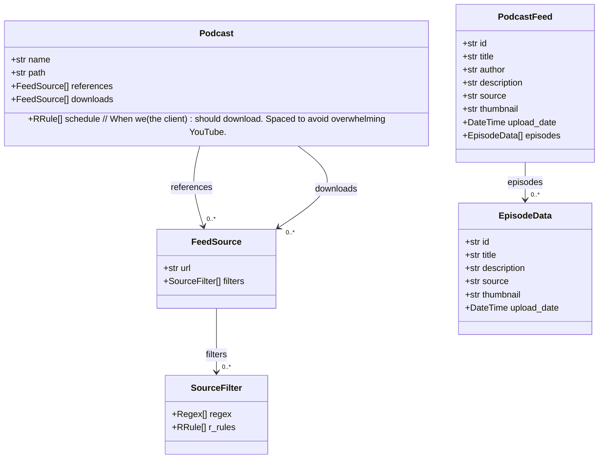
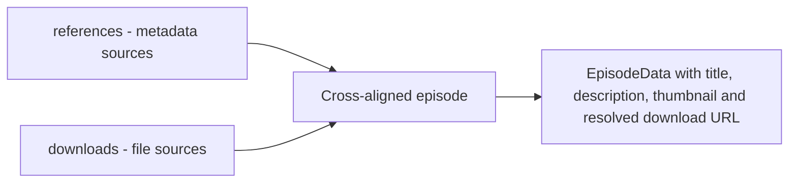
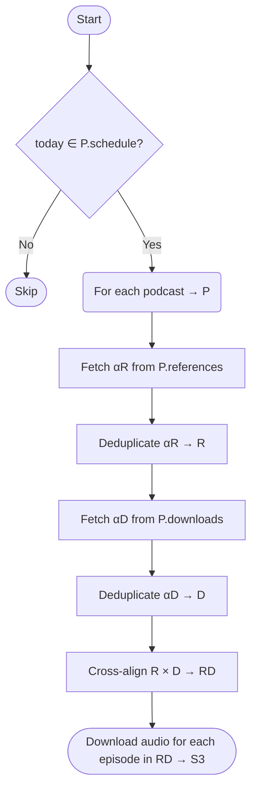
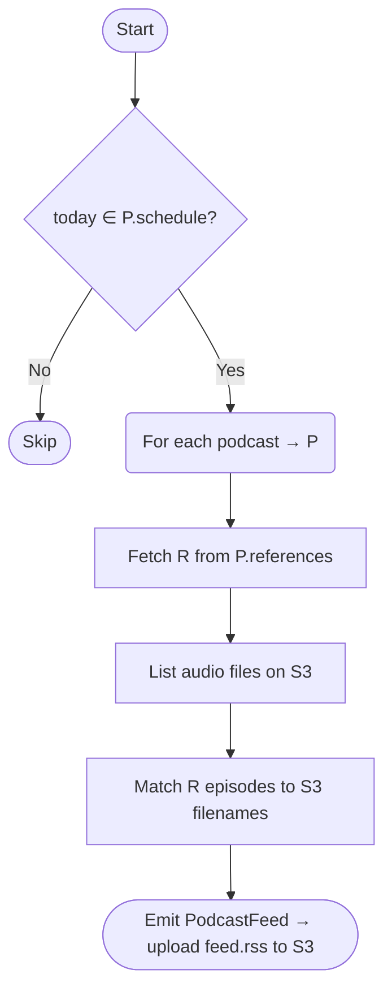
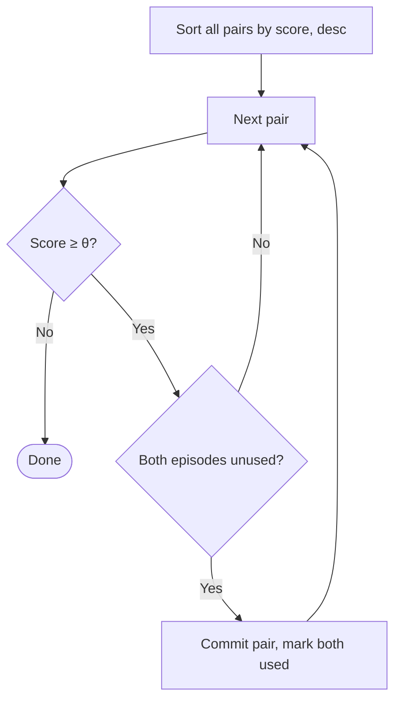
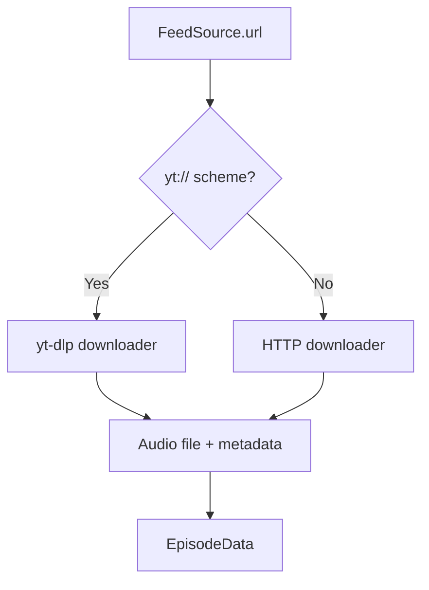

# Podcast Feed Builder — Specification

## Models



### Source URL conventions

| Scheme | Example | Description |
| --- | --- | --- |
| HTTP/S feed | `https://example.com/feed.rss` | Standard RSS/Atom feed |
| YouTube channel | `yt://@channel_handle` | Channel episode list |
| YouTube video | `yt://#video_id` | Single episode reference |

### Schedule conventions (RFC 5545)

`Podcast.schedule` is a list of recurrence definitions used to decide whether a
podcast should run on the current day.

Supported formats:

| Format | Example | Notes |
| --- | --- | --- |
| Legacy RRULE-only | `FREQ=WEEKLY;BYDAY=MO` | Backward-compatible shorthand |
| RFC 5545 DTSTART + RRULE | `DTSTART:20240124T000000Z\nRRULE:FREQ=WEEKLY;BYDAY=MO` | Preferred when a recurrence start date is required |

TOML example:

```toml
[[podcasts]]
name = "The Daily Show"
schedule = ["DTSTART:20240124T000000Z\nRRULE:FREQ=WEEKLY;BYDAY=MO"]
```

Notes:

- `DTSTART` establishes the recurrence start boundary.
- `BYDAY=MO` with this start date yields Monday occurrences from the first Monday on/after the start boundary.
- Schedule recurrence controls when a podcast is processed, not per-episode publish-date eligibility.

### References vs Downloads

`Podcast.references` and `Podcast.downloads` serve distinct roles in the build pipeline, and a single episode must have a match in both.

The cross-alignment step pairs each **download source** record with its corresponding **reference record**. The merged result carries the metadata from the reference side and the download URL from the download side.



* * *

## Process Flow

The pipeline runs in two separate phases per podcast. Both phases respect `Podcast.schedule`.

### Phase 1 — Download

Fetch candidate episodes from both sources, cross-align them, then download only the matched subset.



> **Note:** Steps D and F use the same 4-signal greedy matcher as the cross-alignment step (G), applied within each source list to collapse near-duplicates from overlapping feeds. The greedy algorithm prevents double-use, so no additional deduplication pass is needed after step G.

### Phase 2 — RSS Feed Rebuild

Rebuild the RSS feed from reference metadata matched against files already on S3.



> **Stage 3 deferred:** `merge_episode` resolves each cross-aligned pair into a canonical `EpisodeData` (see §Stage 3 below). This merge is not yet applied in Phase 2 — the RSS feed is currently built from reference metadata only. YouTube titles, thumbnails, and descriptions are not yet used in the emitted feed.

### Tuning Parameters

| Parameter | Default | Effect |
| --- | --- | --- |
| `θ` (score threshold) | `0.75` | Higher → fewer matches, lower → more aggressive |
| `w_id` | `0.10` | Weight given to ID similarity |
| `w_date` | `0.30` | Weight given to date similarity |
| `w_title` | `0.50` | Weight given to title similarity |
| `w_desc` | `0.10` | Weight given to description similarity |

### Stage 1 — Similarity Scoring

For each pair `(e1, e2)` in the cross-product of the two episode lists, compute a weighted similarity score:

```text
Score(e1, e2) =  w_id   · sim_id(e1, e2)
              +  w_date  · sim_date(e1, e2)
              +  w_title · sim_title(e1, e2)
              +  w_desc  · sim_desc(e1, e2)

sim_id(e1, e2)    — 1.0 if IDs are identical; 0.0 otherwise
sim_date(e1, e2)  — tiered by |date difference|:
                      ≤ 2 days  → 1.00
                      ≤ 10 days → 0.70
                      ≤ 35 days → 0.15
                      otherwise → 0.00
sim_title(e1, e2) — fuzzy title similarity after normalization
sim_desc(e1, e2)  — fuzzy description similarity after normalization;
                    0.0 when both descriptions are empty
```

All scored pairs are passed to the greedy matcher.

> **Cross-platform note:** Episodes compared across ID namespaces (e.g. a YouTube source vs an RSS feed) will always have `sim_id = 0.0`, capping the maximum achievable score at `0.60` before date and title are considered. Keeping `w_id` small (default `0.10`) ensures this is a modest same-platform bonus rather than an impassable gate. The practical consequence is that cross-platform matches with a week-tier date offset require `sim_title ≥ 0.91` to exceed `θ` — a high but realistic bar for the same episode across platforms.

### Stage 2 — Greedy Matching

Sort all scored pairs descending by score. Iterate through them: if neither episode in a pair has been matched yet, commit the pair and mark both as used. Stop when the next candidate pair's score falls below θ.

This guarantees the globally best match is always preferred first. It also prevents a near-duplicate title (e.g. a multi-part episode) from stealing a match that belongs to a higher-scoring pair — once the correct pair is committed, both episodes leave the pool.



For more than two source feeds, apply iteratively: `match(match(lst1, lst2), lst3)`.

### Stage 3 — Merge

Resolve each matched pair to a single canonical `EpisodeData` using field-level precedence:

| Field | Resolution rule |
| --- | --- |
| `id` | Prefer non-URL ID; tie-break to download side (YouTube video ID › RSS GUID) |
| `title` | Longest / most punctuated (heuristic), or modal value |
| `upload_date` | Earliest date in pair |
| `description` | Longest non-empty value |
| `thumbnail` | Prefer highest-resolution (inferred from URL) |
| `source` | Union of all source URLs in pair |

> **Deferred:** Stage 3 merge is implemented in `merge_episode` (`src/catalog.py`) and covered by tests, but is not yet wired into Phase 2. The RSS feed is currently emitted using reference metadata directly.

## Episode Download Strategy: yt-dlp vs URL

Episodes download according to the `FeedSource.url` scheme:

- `yt://` sources resolve to YouTube content and are handled by **yt-dlp**.
- `https://` sources are plain HTTP resources downloaded directly.



### yt:// Sources — yt-dlp

yt-dlp is a feature-rich command-line downloader that handles YouTube's stream selection, format negotiation, and metadata extraction. It requires **FFmpeg** to mux or transcode streams — without it, yt-dlp cannot merge separate audio/video tracks or convert formats.

### https:// Sources — HTTP Download

Plain URL episodes (standard RSS/Atom enclosures, direct MP3/M4A links) are fetched with a simple HTTP client. No format negotiation is needed — the server delivers the file as-is.
