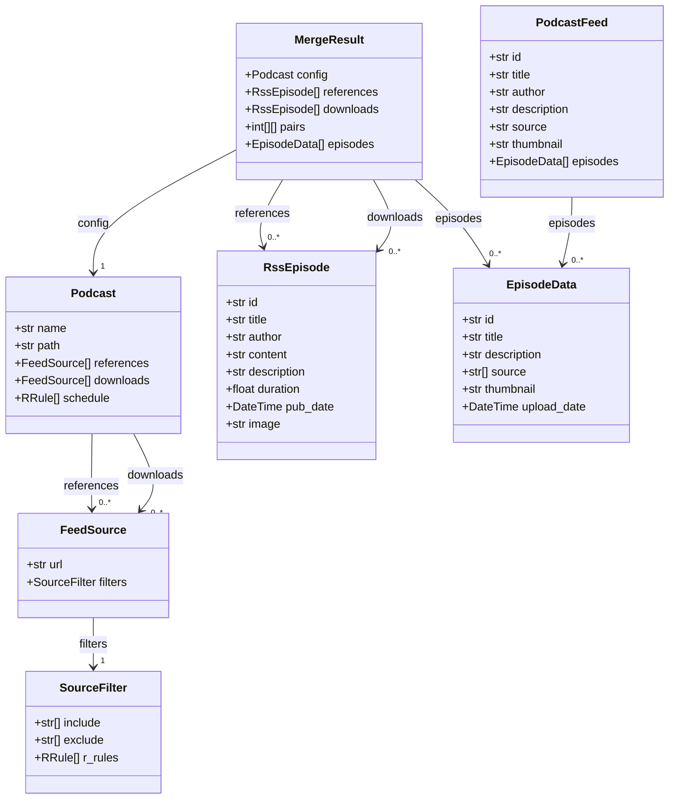
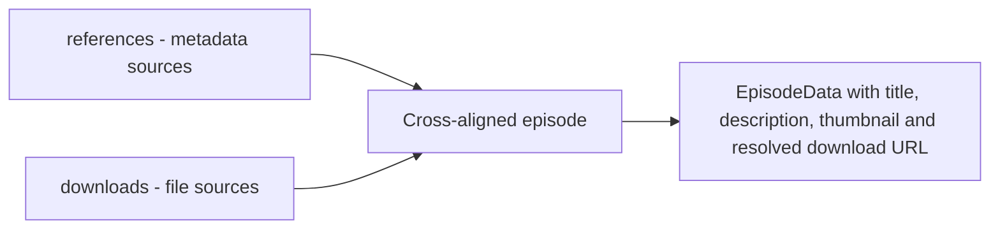

# Podcast Feed Builder — Specification

This specification blends the concise overview and operational details. It defines the data models, pipeline phases, scoring and matching rules, merge behaviour, and the tests/quality gates that guard regressions.

---

## Models



Key types: `Podcast` (config), `FeedSource` (reference or download), `RssEpisode` (feed item), `EpisodeData` (canonical merged record), and `MergeResult` (cross-alignment + merge output).

### Source URL conventions

| Scheme | Example | Description |
| --- | --- | --- |
| HTTP/S feed | <https://example.com/feed.rss> | Standard RSS/Atom feed |
| YouTube channel | yt://@channel_handle | Channel episode list |
| YouTube video | yt://#video_id | Single episode reference |

---

## Scheduling (RFC 5545)

`Podcast.schedule` uses RFC 5545 RRULE strings. Supported forms include a legacy RRULE-only shorthand and `DTSTART` + `RRULE` when a start boundary is required.

| Format | Example | Notes |
| --- | --- | --- |
| RRULE-only | `FREQ=WEEKLY;BYDAY=MO` | Backward-compatible shorthand |
| `DTSTART` + `RRULE` | `DTSTART:20240124T000000Z\nRRULE:FREQ=WEEKLY;BYDAY=MO` | Use when a start boundary is required |

Example TOML configuration:

```toml
[[podcasts]]
name = "The Daily Show"
schedule = ["DTSTART:20240124T000000Z\nRRULE:FREQ=WEEKLY;BYDAY=MO"]
```

Schedules control when a podcast is processed (pipeline runs), not per-episode publish eligibility.

---

## References vs Downloads

`references` supply metadata (title, description, GUID); `downloads` supply file URLs (S3, direct hosts, YouTube). Cross-alignment pairs a download record with a reference record; the merged `EpisodeData` prefers reference metadata and uses the download URL for retrieval.



Deduplication is applied within each source to collapse near-duplicates; then cross-alignment pairs the condensed lists.

---

## Process (phases)

Phase 1 — Download

1. Fetch candidate items from `Podcast.references` (αR) and `Podcast.downloads` (αD).
2. Deduplicate αR → R and αD → D (the same 4-signal greedy matcher used internally).
3. Cross-align R × D → pairs using the greedy matcher.
4. Download matched files to S3.

Phase 2 — RSS rebuild

1. Fetch `R` from `Podcast.references`.
2. List audio files on S3 and match R episodes to S3 filenames.
3. Emit `PodcastFeed` and upload `feed.rss`.

Notes:

- The greedy matcher is used both for intra-source deduplication and for cross-alignment; it prevents double-use of the same download or reference.
- `merge_episode` resolves a committed pair into an `EpisodeData` record (see Merge rules).

---

## Tuning parameters

| Parameter | Effect |
| --- | --- |
| `θ` (score threshold) | Minimum accepted match score; higher → stricter matching |
| `w_id` | Weight / bonus for ID agreement |
| `w_date` | Weight for date similarity |
| `w_title` | Weight for title similarity |
| `w_desc` | Weight for description similarity |

## Stage 1 — Similarity scoring

For each pair `(e1,e2)` compute a weighted similarity across four signals:

```text
Score(e1,e2) = w_id · sim_id + w_date · sim_date + w_title · sim_title + w_desc · sim_desc
```

Details:

- `sim_id`: 1.0 if IDs match, else 0. The ID bonus is applied as an additive reward (small `w_id`) after normalization so same-platform IDs help but do not block cross-platform matching.
- `sim_date`: tiered by absolute date difference — ≤2d → 1.00, ≤10d → 0.70, ≤35d → 0.15, otherwise 0.00.
- `sim_title`, `sim_desc`: normalized fuzzy similarity after title and description normalization.

Signals that are absent for a pair (missing date or empty descriptions) are excluded from normalization; the remaining signals are renormalized so missing fields do not unfairly penalize candidates.

Reject early: pairs with no ID match, no descriptions, and very low title similarity can be skipped without full scoring.

---

## Stage 2 — Greedy matching

1. Score all pairs.
2. Sort pairs by score descending.
3. Iterate: if both episodes in the pair are unused and score ≥ `θ`, commit the pair and mark both used; otherwise skip.
4. Stop when the next candidate score < `θ`.

This produces a one-to-one assignment favouring globally highest-scoring pairs. For more than two source lists apply iteratively: `match(match(a,b), c)`.

---

## Stage 3 — Merge rules

Field-level precedence when resolving a matched pair into `EpisodeData`:

| Field | Rule |
| --- | --- |
| `id` | Prefer stable non-URL ID; tie-break to download side (YouTube ID > RSS GUID) |
| `title` | Prefer longest / most punctuated or modal value |
| `upload_date` | Earliest date in the pair |
| `description` | Longest non-empty value |
| `thumbnail` | Prefer highest-resolution or most complete URL |
| `source` | Union of all source URLs in the pair |

`merge_episode` (implemented in `src/catalog.py`) performs this resolution; its behaviour is covered by unit tests (`tests/catalog/*`). Integration into the Phase 2 emitter remains pending.

---

## Tests & quality gates

- Regression rows: `tests/resources/alignment/morbid_benchmark.csv` — add a row for every fixed false negative.
- Unit tests: `tests/catalog/test_align_episodes.py` covers date-tiering, containment, part/volume/episode guards, and certainty-path behaviour.
- Lint/CCN: `tests/test_lint.py` enforces ruff/import-sort and CCN ≤ 8.

---

## Operational recommendations

- For greedy conflicts keep a small manual-override map keyed by `(ref_id, dl_id)`.
- When structural renames occur, record an explicit mapping rather than weakening the global threshold.
- To recover older episodes, expand download sources (archive.org, other mirrors) rather than lowering `θ`.

---

File: [docs/SPECS.md](docs/SPECS.md)
