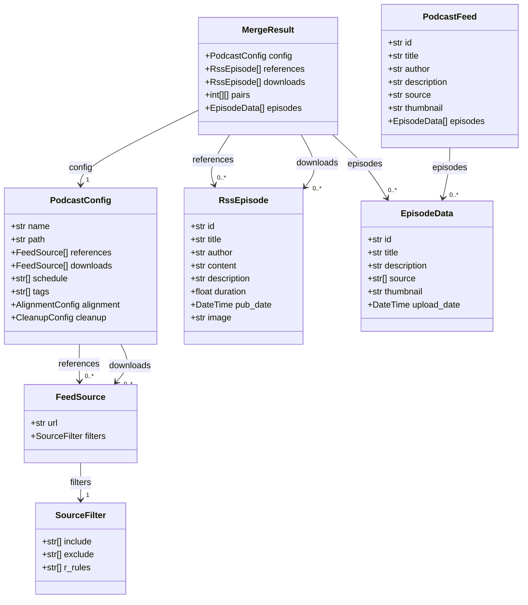
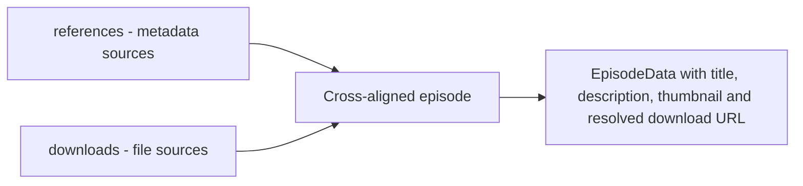

# Podcast Feed Builder -- Specification

This specification blends the concise overview and operational details. It defines the data models, pipeline phases, scoring and matching rules, merge behaviour, and the tests/quality gates that guard regressions.

---

## Models

All models live in `adrift/models/`. The class diagram shows the core fields; secondary fields (traces, sponsor data, tuning knobs) are noted below.


```mermaid
classDiagram
    class SourceFilter {
        +str[] include
        +str[] exclude
        +str[] r_rules
    }

    class FeedSource {
        +str url
        +SourceFilter filters
    }

    class PodcastConfig {
        +str name
        +str path
        +FeedSource[] references
        +FeedSource[] downloads
        +str[] schedule
        +str[] tags
        +AlignmentConfig alignment
        +CleanupConfig cleanup
    }

    class RssEpisode {
        +str id
        +str title
        +str author
        +str content
        +str description
        +float duration
        +DateTime pub_date
        +str image
    }

    class EpisodeData {
        +str id
        +str title
        +str description
        +str[] source
        +str thumbnail
        +DateTime upload_date
    }

    class MergeResult {
        +PodcastConfig config
        +RssEpisode[] references
        +RssEpisode[] downloads
        +int[][] pairs
        +EpisodeData[] episodes
    }

    class PodcastFeed {
        +str id
        +str title
        +str author
        +str description
        +str source
        +str thumbnail
        +EpisodeData[] episodes
    }

    PodcastConfig --> "0..*" FeedSource : references
    PodcastConfig --> "0..*" FeedSource : downloads
    FeedSource --> "1" SourceFilter : filters
    MergeResult --> "1" PodcastConfig : config
    MergeResult --> "0..*" RssEpisode : references
    MergeResult --> "0..*" RssEpisode : downloads
    MergeResult --> "0..*" EpisodeData : episodes
    PodcastFeed --> "0..*" EpisodeData : episodes
```

Key types: `PodcastConfig` (per-series config, `adrift/models/podcast_config.py`), `FeedSource` (reference or download), `RssEpisode` (feed item; `content` holds the media/source URL, `adrift/models/metadata.py`), `EpisodeData` (canonical merged record, `adrift/models/output.py`), and `MergeResult` (cross-alignment + merge output, `adrift/models/pipeline.py`).

Notes:

- `MergeResult` also carries diagnostic fields (`source_traces`, `match_traces`) and `download_episodes` (download-side episodes enriched with SponsorBlock segments during the download pipeline).
- `PodcastConfig.alignment` (`AlignmentConfig`) holds the per-podcast tuning knobs described under "Tuning parameters"; `cleanup` holds title-normalization rules.
- `PodcastFeed` is defined for RSS generation but the current Phase 2 emitter builds RSS directly from matched `RssEpisode` records (see Merge rules).

### Source URL conventions

| Scheme | Example | Description |
| --- | --- | --- |
| HTTP/S feed | <https://example.com/feed.rss> | Standard RSS/Atom feed |
| YouTube channel | yt://@channel_handle | Channel episode list |
| YouTube playlist | yt://#playlist_id | Playlist episode list |

Regexes for these shorthands live in `adrift/utils/regex.py`.

---

## Scheduling (RFC 5545)

`PodcastConfig.schedule` uses RFC 5545 RRULE strings. Supported forms include a legacy RRULE-only shorthand and `DTSTART` + `RRULE` when a start boundary is required (parsed in `adrift/utils/schedule.py`).

| Format | Example | Notes |
| --- | --- | --- |
| RRULE-only | `FREQ=WEEKLY;BYDAY=MO` | Backward-compatible shorthand |
| `DTSTART` + `RRULE` | `DTSTART:20240124T000000Z\nRRULE:FREQ=WEEKLY;BYDAY=MO` | Use when a start boundary is required |

Example TOML configuration:

```toml
[[podcasts]]
name = "The Daily Show"
schedule = ["DTSTART:20240124T000000Z\nRRULE:FREQ=WEEKLY;BYDAY=MO"]
```

Schedules control when a podcast is processed (pipeline runs), not per-episode publish eligibility.

---

## References vs Downloads

`references` supply metadata (title, description, GUID); `downloads` supply file sources (YouTube channels/playlists, direct hosts). Cross-alignment pairs a download record with a reference record; the merged `EpisodeData` prefers reference metadata and uses the download URL for retrieval.


```mermaid
flowchart LR
  REF[references - metadata sources] --> RD[Cross-aligned episode]
  DL[downloads - file sources] --> RD
  RD --> EP[EpisodeData with title, description, thumbnail and resolved download URL]
```

Deduplication is applied within each source to collapse near-duplicates; then cross-alignment pairs the condensed lists.

---

## Storage

Downloaded media and generated feeds are written through the `StoragePort` interface. The current adapter is `LocalFilesystemStorage` (`adrift/adapters/process/storage/local_storage.py`): a plain directory tree laid out as `<root>/<bucket>/<key>`, with optional JSON metadata sidecars. Mounting a remote store at `<root>` (e.g. an rclone mount) is an infrastructure concern outside the adapter. Each podcast's objects live under the bucket/prefix derived from `PodcastConfig.path` (`storage_prefix` in `adrift/services/download_client.py`).

---

## Process (phases)

Phase 1 -- Download

1. Fetch candidate items from `PodcastConfig.references` ($\alpha_R$) and `PodcastConfig.downloads` ($\alpha_D$).
2. Deduplicate $\alpha_R \to R$ and $\alpha_D \to D$ (the same 4-signal greedy matcher used internally).
3. Cross-align $R \times D \to$ pairs using the greedy matcher.
4. Download matched files to the storage backend.

Phase 2 -- RSS rebuild

1. Fetch `R` from `PodcastConfig.references`.
2. List audio files in storage and match R episodes to the stored filenames.
3. Build the RSS document from the matched episodes and upload `feed.rss` under the podcast's storage prefix. If no episodes matched (usually a transient source-fetch failure), the upload is skipped so a healthy existing `feed.rss` is not overwritten with a broken stub (`update_rss` in `adrift/services/download_rss.py`).

Notes:

- The greedy matcher is used both for intra-source deduplication and for cross-alignment; it prevents double-use of the same download or reference.
- `merge_episode` resolves a committed pair into an `EpisodeData` record (see Merge rules).

---

## Tuning parameters

Tuning lives on `AlignmentConfig` (`adrift/models/podcast_config.py`) and can be set per podcast under `[podcasts.alignment]` in TOML.

| Parameter | Default | Effect |
| --- | --- | --- |
| `match_tolerance` ($\theta$) | 0.75 | Minimum accepted match score; higher means stricter matching |
| `weights.id` | 0.10 | Additive bonus for ID agreement |
| `weights.date` | 0.30 | Weight for date similarity |
| `weights.title` | 0.50 | Weight for title similarity |
| `weights.description` | 0.10 | Weight for description similarity |
| `date_score_tiers` | `[(2, 1.00), (10, 0.70), (35, 0.15)]` | Date-difference tiers (days, score) |
| `sparse_title_min` | 0.85 | Minimum title similarity when other signals are sparse |
| `extra_stopwords` | `[]` | Additional stopwords for title normalization |

## Stage 1 -- Similarity scoring

For each pair `(e1, e2)` compute a weighted similarity across four signals:

```text
Score(e1,e2) = w_id * sim_id + w_date * sim_date + w_title * sim_title + w_desc * sim_desc
```

Details:

- `sim_id`: 1.0 if IDs match, else 0. The ID bonus is applied as an additive reward (small `weights.id`) after normalization so same-platform IDs help but do not block cross-platform matching.
- `sim_date`: tiered by absolute date difference -- by default $\le 2$ days scores 1.00, $\le 10$ days scores 0.70, $\le 35$ days scores 0.15, otherwise 0.00 (`date_score_tiers`).
- `sim_title`, `sim_desc`: normalized fuzzy similarity after title and description normalization.

Signals that are absent for a pair (missing date or empty descriptions) are excluded from normalization; the remaining signals are renormalized so missing fields do not unfairly penalize candidates.

Reject early: pairs with no ID match, no descriptions, and very low title similarity can be skipped without full scoring.

Scoring backends: the pure-Python implementation lives in `adrift/services/catalog/alignment.py`; optimized adapters (including an optional Rust extension selected via `ADRIFT_ALIGNMENT_BACKEND=rust`) live in `adrift/adapters/process/alignment/`.

---

## Stage 2 -- Greedy matching

1. Score all pairs.
2. Sort pairs by score descending.
3. Iterate: if both episodes in the pair are unused and score $\ge \theta$, commit the pair and mark both used; otherwise skip.
4. Stop when the next candidate score $< \theta$.

This produces a one-to-one assignment favouring globally highest-scoring pairs. For more than two source lists apply iteratively: `match(match(a,b), c)`.

---

## Stage 3 -- Merge rules

Field-level precedence when resolving a matched pair into `EpisodeData`:

| Field | Rule |
| --- | --- |
| `id` | Prefer stable non-URL ID; tie-break to download side (YouTube ID > RSS GUID) |
| `title` | Prefer longest / most punctuated or modal value |
| `upload_date` | Earliest date in the pair |
| `description` | Longest non-empty value |
| `thumbnail` | Prefer highest-resolution or most complete URL |
| `source` | Union of all source URLs in the pair |

`merge_episode` (implemented in `adrift/services/catalog/alignment.py`) performs this resolution; its behaviour is covered by unit tests (`tests/unit/models/catalog/`). Integration into the Phase 2 emitter remains pending -- `update_rss` currently emits RSS from matched `RssEpisode` records rather than merged `EpisodeData`/`PodcastFeed`.

---

## Tests & quality gates

- Regression rows: `tests/resources/alignment/morbid_benchmark.csv` (exercised by `tests/unit/models/catalog/test_morbid_benchmark.py`) -- add a row for every fixed false negative.
- Unit tests: `tests/unit/models/catalog/test_align_episodes.py` covers date-tiering, containment, part/volume/episode guards, and certainty-path behaviour.
- Lint gates: `tests/test_lint.py` runs ruff (check + format), ty, Lizard (CCN $\le 8$, length $\le 30$; `adrift/cli/*` excluded), jscpd copy-paste detection, import-linter dependency contracts (`pyproject.toml`), scaffold shape checks (pytest), ast-grep AST rules (`static/rules/ast-grep`), and Vulture dead-code detection.
- Performance benchmarks: `tests/benchmarks/` (opt-in via `RUN_PERF_TESTS=1`).

---

## Operational recommendations

- For greedy conflicts keep a small manual-override map keyed by `(ref_id, dl_id)`.
- When structural renames occur, record an explicit mapping rather than weakening the global threshold.
- To recover older episodes, expand download sources (archive.org, other mirrors) rather than lowering $\theta$.

---

File: [docs/SPECS.md](docs/SPECS.md)
